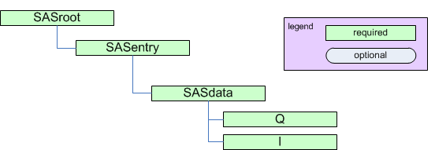
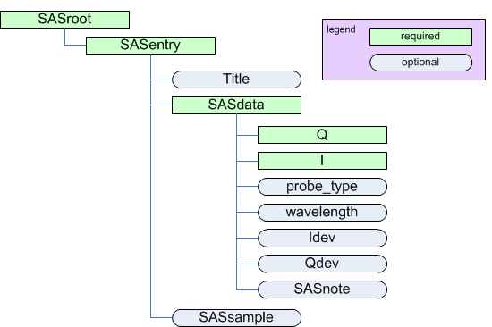

.. $Id$

.. _framework overview:

==================================================
Overview of the canSAS2012 data format
==================================================

.. sidebar:: work in progress...

	This document is under construction.
	Many parts have yet to be written.

.. describe the framework

Goals
==============

Describe the structure of data to be presented for small-angle scattering analysis.
Make the structure sufficiently general that it may be used for analysis of any form
of reduced SAS data.

The hierarchical structure of the canSAS standard has been designed to be 
compatible with the NeXus data format.

Description
==============

Absolute minimum requirement for analysis of SAS data
-------------------------------------------------------

The *least* amount of information necessary for meaningful 
small-angle scattering analysis is the presentation of 
the :math:`I(Q)` SAS data.  In the canSAS standard,
this data is presented within 
a *SASdata* group (holding the data from a single experiment), 
inside of *SASentry* group (holding the data from a single sample),
inside of a *SASroot* group (holding one or more experiments).

.. note:: It is recommended to store more metadata than this absolute minimum standard shows.
   See the section :ref:`minimum recommended content` for more details.

    Absolute minimum requirement for analysis of SAS data.
    
Alternatively, this may be shown using a more condensed :ref:`notation <notation>`, as:

.. code-block:: text
  :linenos:
  
  SASroot
    SASentry
      SASdata
        @Q_indices=0
        @I_axes="Q"
        I: float[]
        Q: float[]

.. _minimum recommended content:

Minimum content recommended for reduced SAS data
--------------------------------------------------

It is recommended that instruments provide at least the information described 
in this section to satisfy the needs of data analysis and visualization software.

    Minimum content recommended for reduced SAS data.

.. code-block:: text
  :linenos:
  
  SASroot
    SASentry
      Title: string
      SASdata
        @Q_indices=0
        @I_axes="Q"
        I: float[]
        Q: float[]
        probe_type: string
        wavelength: float (or possibly float[])
        Idev: float[]
        Qdev: float[]
        SASnote
          anything: string, float, float[], ...
      SASsample
        name: string
        
--------------

.. caution:: re-write from this point downward on this page

Terms
===============

.. index:: ! SASroot
	groups; SASroot
	
.. sidebar:: TODO!

	break this up into tables for each group

**SASroot**:
	derived from original 1D format, attributes have changed
	
	.. caution:: needs full write-up

	.. index:: ! SASentry
		groups; SASentry
	
	**SASentry**:
		derived from original 1D format, content and attributes have changed
		
		.. caution:: needs full write-up
		
		*SASentry* groups have several attributes:
	
		:@name: Text that describes this group.
					Must conform to the `naming standard <naming standard>` 
					and must be unique within a *SASentry* group.  Such as::
					
						@name="sasentry01"
		:@version: Describes the version of the canSAS standard used to write this data.
					This must be a text (not numerical) representation.  Such as::
					
						@version="1.0"

		.. index:: ! SASdata
			groups; SASdata
		
		**SASdata**:
			different use from original 1D format, refers to a single
			reduced data set that can be represented thus (such as
			from one detector)
			
			*SASdata* groups have several attributes:
		
			:@name: Text that describes this group.
						Must be unique within a SASentry group.  Such as::
						
							@name="sasdata01"
		
			:@I_axes: Comma-separated list that describes the names 
						of the data objects that correspond to the 
						indices of the ``I`` data object.  Such as::
						
							@I_axes="Temperature,Time,Pressure,Q,Q"
			:@Q_indices: Array that describes which indices 
						(of the :math:`I` data object) are used to 
						reference the ``Q`` data object. The items in this array 
						use zero-based indexing.  Such as::
						
							@Q_indices=1,3,4
						
						which indicates that Q requires three indices
						from the :math:`I` data object: one for time and
						two for Q position. 
			:@Mask_indices: Array that describes which indices
						(of the :math:`I` data object) are used to 
						reference the ``Mask`` data object.  The items in this
						array use zero-based indexing.  Such as::
						
							@Mask_indices=3,4
						
						which indicates that Q requires two indices
						from the :math:`I` data object for Q position.

			To indicate the dependency relationships of other varied parameters, 
			use attributes similar to ``@Mask_indices`` (such as ``@Temperature_indices``
			or ``@Pressure_indices``).
		
		**SASsample**:
			derived from original 1D format, content and attributes have changed
			
			.. caution:: needs full write-up

		.. index:: ! Title

		**Title**:
			(string) Title of this *SASentry*.  
			Optional attribute:  *name={short-Run-identifier}*.
			Example::
			
				Glassy Carbon C4 12keV

.. index:: ! data objects
.. _data objects:

Data Objects
------------

Storage container [#data_object]_ with numerical data for analysis or any kind of metadata.  
All data objects have attributes, some required, some optional.
The name chosen for each data object must adhere to the `naming standard`_ described below.

:@size: (required for numerical arrays) Number of items in this data object.  
			If the array is multi-dimensional, then the length of each index
			is reported individually, separated by commas.  Such as::
			
				size="100,512"
			
			describes a 2-D array of 100 rows and 512 columns.
			Some implementations (such as HDF5 which uses *shape*) may provide 
			native versions of the size.  Use the native capability, when present.

.. index:: !units
	Unidata UDunits
	UDunits

.. _units:

:@units: (required for all numerical objects) 
			Engineering units of this data object.  
			Use the `Unidata UDunits`_ [#UDunits]_ 
			specification as this is compatible with
			various community standards.

.. index:: !uncertainty

:@uncertainty: (optional for numerical arrays) 
			Name of the data object (in this *SASdata* group) that
			provides the uncertainty to be used for data analysis.

.. _naming standard:

Naming Standard
---------------

The **names** for data objects should follow a standard 
convention that starts with a letter (upper or lower case) and 
then a sequence composed of letters, numbers, and/or "_". 
The length of the name is limited 
to no more than 63 characters (imposed by the HDF5 rule for names).

	.. index:: ! naming standard; regular expression
	
	This standard convention for object names may be 
	described by this regular expression::
	
		[A-Za-z][\\w_]* 

.. index:: ! uncertainty; supplemental
.. _supplementary uncertainty:

Supplementary Uncertainty Data
------------------------------

A special case discussed at canSAS2012.

Requires a named subdirectory below *SASdata* to contain the supplementary data.
The name of the subdirectory is given in an attribute of the data object.

Contents:

.. toctree::
   :maxdepth: 2
   
   metadata

---------------------------

.. rubric:: Footnotes

.. [#data_object] Such as text, a scalar, or an array. HDF5 calls this a *dataset*,   
	Not a folder or a group or an object that contain other objects.
.. _Unidata UDunits: http://www.unidata.ucar.edu/software/udunits/udunits-2-units.html
.. [#UDunits]
    The :index:`UDunits` specification also includes instructions for derived units.

..
	Contents:
	
	.. toctree::
	   :maxdepth: 2

.. Examples of reST structures that might be useful while writing this document

	.. code-block:: text
	    :linenos:

	.. literalinclude:: ../markup_example/hkl_ioc.mac.original
	    :tab-width: 4
	    :linenos:
	    :language: guess

	.. figure:: graphics/example1.png
	    :alt: view of original hkl_ioc.mac HTML documentation
	
	    Documentation of the original **hkl_ioc.mac** file.

